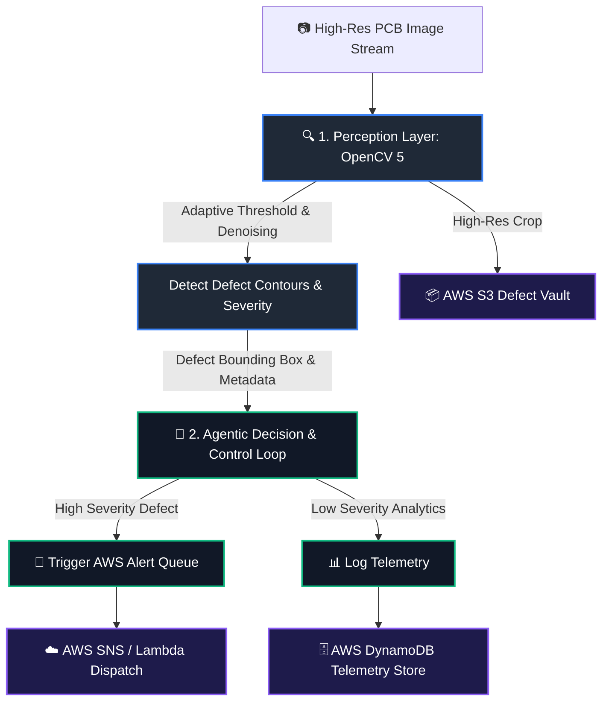

# Autonomous PCB Defect Inspection Agent 🔍⚡
> **OpenCV AI Competition 2026 Submission** | Powered by **OpenCV 5** & **AWS**

## 📌 Overview
An intelligent, closed-loop PCB defect detection system that uses **OpenCV 5** for computer vision and **AWS Serverless infrastructure** to run an **Agentic Decision Loop**. 

Unlike static inspection scripts, this system evaluates visual evidence dynamically: when a defect is detected, the agent determines the next best action—adjusting image capture parameters, triggering localized high-resolution re-scans, dispatching alerts via AWS SNS, and logging structured defect analytics in AWS DynamoDB.

---

## 🏗️ System Architecture

---

## ✨ Key Features
- **Agentic Perception-Decision Loop:** Vision outputs directly drive execution workflow decisions.
- **OpenCV 5 Optimization:** Fast feature extraction and defect isolation.
- **AWS Cloud Integration:** Fully serverless telemetry, storage, and event routing.
- **Reproducible Evaluation:** Comprehensive test scripts with synthetic and real-world PCB defect samples.

---

## 🚀 Getting Started
```bash
# Clone the repository
git clone [https://github.com/umeshianjana/PCB-Defect-Inspection-Agent.git](https://github.com/umeshianjana/PCB-Defect-Inspection-Agent.git)
cd PCB-Defect-Inspection-Agent

# Install dependencies
pip install -r requirements.txt
